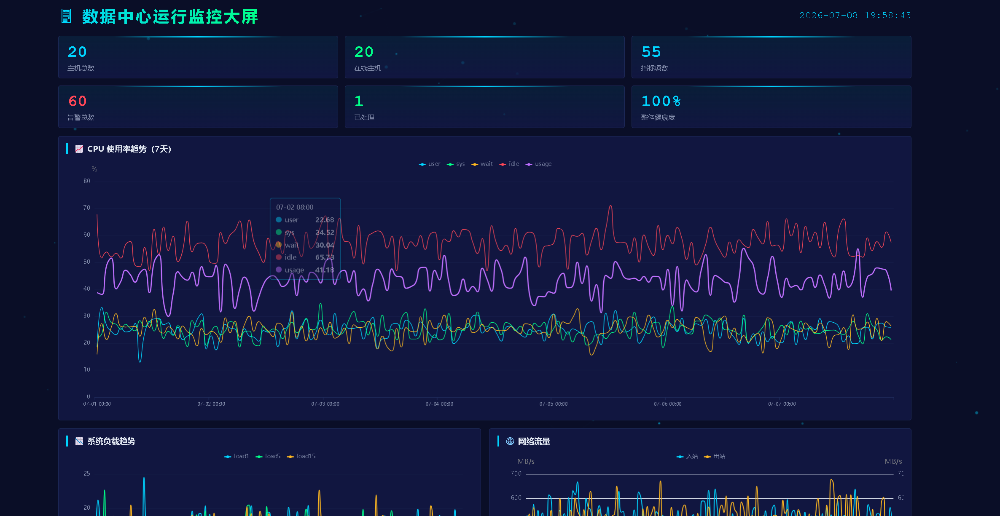

# datacenter-screen

数据中心运行监控大屏 — 基于真实服务器监控数据的可视化仪表盘。

## 功能

- 10 个数据 API，覆盖统计、趋势、排名、告警
- 7 类 ECharts 图表：雷达图、折线图、面积图、堆叠柱状图、水平柱状图、双Y轴折线图
- 暗色主题大屏，自适应两列布局，可滚动
- Canvas 动态粒子背景
- 每 10 秒自动刷新数据



## 技术栈

| 层 | 技术 |
|----|------|
| 前端 | HTML + CSS Grid + ECharts 5.x |
| 后端 | Python Flask + pymysql |
| 数据库 | MySQL 8.0 (Docker) |

## 快速开始

```bash
# 1. 安装依赖
pip install -r requirements.txt

# 2. 启动 MySQL（Docker）
docker start mysql8

# 3. 启动 Flask
python app.py

# 4. 浏览器打开 http://localhost:5000
```

## 数据源

采集自 20 台服务器的 tsar 监控数据：

| 表 | 行数 | 说明 |
|----|------|------|
| host_detail | 20 | 服务器基础信息 |
| mod_detail | 55 | 监控指标定义 |
| disk_tsar | 12,000 | 磁盘监控时序（41天） |
| pref_tsar | 67,200 | 性能监控时序（7天） |

## API

| 接口 | 说明 |
|------|------|
| `/api/stats` | 基础统计 |
| `/api/room-health` | 机房健康度 |
| `/api/host-risk` | 主机风险排名 |
| `/api/disk-top` | 磁盘使用率 TOP5 |
| `/api/cpu-trend` | CPU 趋势 |
| `/api/load-trend` | 系统负载趋势 |
| `/api/disk-io` | 磁盘读写 TOP5 |
| `/api/memory-top` | 内存使用 TOP5 |
| `/api/network` | 网络流量 |
| `/api/alerts` | 告警列表 |

## 项目结构

```
datacenter-screen/
├── app.py
├── requirements.txt
├── design.md                   # UI 设计规范
├── docs/
│   ├── 方案.md                 # 技术方案
│   ├── 报告.md                 # 数据分析报告
│   └── 实习日记.md
├── templates/
│   └── index.html
└── static/
    ├── css/
    │   ├── theme.css           # 色彩变量 + 动画
    │   ├── layout.css          # 页面网格
    │   └── components.css      # 组件样式
    └── js/
        ├── api.js              # 数据接口层
        ├── charts.js           # 图表渲染
        ├── app.js              # 主控逻辑
        └── particles.js        # 背景粒子
```

## 许可证

[MIT](LICENSE)
